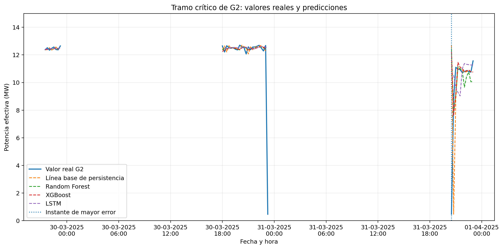

# Pronóstico de potencia efectiva de la central Santa Teresa

## Descripción

Este repositorio contiene el código, los resultados y las representaciones gráficas de un estudio experimental orientado al pronóstico de la potencia efectiva de las unidades generadoras G1 y G2 de la central Santa Teresa.

Se comparan cuatro métodos:

- línea base de persistencia;
- Random Forest;
- XGBoost;
- redes neuronales LSTM.

El horizonte de predicción corresponde a un registro temporal adelante, equivalente a 15 minutos. Se evalúan ventanas de 4, 12 y 24 registros, que representan aproximadamente 1, 3 y 6 horas de información histórica.

## Objetivo

Evaluar el desempeño de una línea base de persistencia, Random Forest, XGBoost y redes LSTM para el pronóstico de corto plazo de la potencia efectiva de las unidades G1 y G2 de la central Santa Teresa.

## Datos

La base original contiene 5057 registros históricos de potencia efectiva, medidos con una frecuencia de 15 minutos entre el 1 de diciembre de 2024 y el 31 de marzo de 2025.

La distribución original corresponde a:

- G1: 2531 registros.
- G2: 2526 registros.

Después de aplicar el máximo retardo de 24 observaciones y construir la variable objetivo correspondiente al siguiente intervalo, se obtiene una matriz supervisada común de 5007 observaciones útiles:

- G1: 2506 observaciones.
- G2: 2501 observaciones.

La base original no se publica debido a consideraciones de confidencialidad y uso institucional.

## Preparación de los datos

Los registros se ordenan cronológicamente por fecha, hora y unidad generadora. Para los modelos tabulares se incorporan retardos, medias móviles, variables temporales e identificador de unidad.

Random Forest y XGBoost se entrenan como modelos globales mediante la matriz conjunta de G1 y G2. LSTM utiliza dos modelos independientes, uno para cada unidad generadora.

La línea base de persistencia utiliza la potencia efectiva del registro actual como estimación del siguiente intervalo de 15 minutos.

## Partición temporal

La matriz supervisada se divide cronológicamente mediante límites temporales comunes para G1 y G2:

| Conjunto | Período | Registros | Proporción |
|---|---|---:|---:|
| Entrenamiento | 02-12-2024 18:45 a 23-02-2025 21:30 | 3505 | 70,00 % |
| Validación | 23-02-2025 21:45 a 13-03-2025 20:45 | 750 | 14,98 % |
| Prueba | 13-03-2025 21:00 a 31-03-2025 22:45 | 752 | 15,02 % |

La separación cronológica evita que los registros futuros intervengan durante el entrenamiento.

## Ventanas temporales

| Ventana | Equivalencia aproximada |
|---:|---|
| 4 registros | 1 hora previa |
| 12 registros | 3 horas previas |
| 24 registros | 6 horas previas |

## Métricas de evaluación

El desempeño se evalúa mediante:

- MAE: error absoluto medio expresado en MW.
- RMSE: raíz del error cuadrático medio expresada en MW.
- MAPE: error porcentual absoluto medio.
- Tiempo de cómputo: duración aproximada del entrenamiento y evaluación.

## Resultados de la partición fija

La línea base de persistencia alcanza:

| Modelo | Ventana | MAE (MW) | RMSE (MW) | MAPE (%) | Tiempo (s) |
|---|---:|---:|---:|---:|---:|
| Persistencia | No aplica | 0,220 | 0,703 | 6,37 | < 0,01 |

Las mejores configuraciones de los modelos entrenados corresponden a:

| Modelo | Ventana | MAE (MW) | RMSE (MW) | MAPE (%) | Tiempo (s) |
|---|---:|---:|---:|---:|---:|
| Random Forest | 24 | 0,192 | 0,649 | 6,54 | 2,977 |
| XGBoost | 4 | 0,197 | 0,643 | 6,50 | 0,190 |
| LSTM | 4 | 0,199 | 0,661 | 6,71 | 8,008 |

Random Forest con 24 registros obtiene el menor MAE agregado. Su configuración de 4 registros alcanza el menor RMSE global, con 0,641 MW, y requiere 0,877 segundos.

XGBoost presenta el menor tiempo de cómputo entre los modelos entrenados. LSTM conserva un desempeño competitivo, aunque demanda mayor tiempo de procesamiento.

## Rolling forecasting

La validación temporal deslizante utiliza una ventana de 12 registros y cuatro cortes expansivos. Cada corte contiene 188 observaciones de prueba, equivalentes a 94 marcas temporales compartidas entre G1 y G2.

Los resultados consolidados corresponden a:

| Modelo | MAE (MW) | RMSE (MW) | MAPE (%) |
|---|---:|---:|---:|
| Persistencia | 0,220 | 0,703 | 6,37 |
| Random Forest | 0,188 | 0,644 | 6,47 |
| XGBoost | 0,230 | 0,812 | 7,41 |
| LSTM | 0,201 | 0,675 | 6,79 |

Random Forest obtiene el menor MAE y RMSE consolidados y mantiene el comportamiento más estable entre los cortes temporales.

LSTM mejora al incorporar progresivamente observaciones recientes. XGBoost presenta mayor sensibilidad durante el último corte, donde se concentran cambios abruptos de potencia efectiva.

## Análisis de errores

Los errores puntuales más elevados se concentran en las reducciones abruptas registradas en G2 durante el 30 y 31 de marzo de 2025.

El mayor error absoluto corresponde a la línea base de persistencia, con 12,221 MW. LSTM registra el segundo mayor error puntual, con 12,087 MW. Random Forest y XGBoost también presentan errores superiores a 11 MW durante estos eventos.

Los modelos representan adecuadamente los períodos de estabilidad, pero no anticipan caídas asociadas con información operativa ausente en las variables de entrada.



## Resultado general

Random Forest presenta el mejor equilibrio entre precisión y estabilidad temporal. XGBoost constituye la alternativa de menor tiempo de cómputo entre los modelos entrenados. LSTM mantiene capacidad para representar la dinámica secuencial regular y mejora mediante la actualización progresiva del entrenamiento.

La persistencia conserva utilidad como referencia inmediata en los períodos estables, aunque presenta dificultades ante cambios abruptos.

## Estructura del repositorio

```text
pronostico-potencia-santa-teresa-final/
├── README.md
├── requirements.txt
├── .gitignore
├── datos/
│   └── README_DATOS.md
├── src/
│   ├── experimento_modelos.py
│   ├── rolling_forecasting.py
│   ├── generar_figuras.py
│   └── analisis_errores.py
├── resultados/
│   ├── metricas_particion_fija.csv
│   ├── metricas_por_unidad_y_ventana.csv
│   ├── predicciones_por_ventana.csv
│   ├── particion_temporal.csv
│   ├── mejor_configuracion_por_modelo.csv
│   ├── mejor_resultado_por_ventana.csv
│   ├── resultados_rolling_por_corte.csv
│   ├── resultados_rolling_consolidados.csv
│   ├── comparacion_fijo_rolling.csv
│   ├── principales_errores_absolutos.csv
│   ├── concentracion_errores_por_unidad.csv
│   └── instante_critico_g2.csv
└── figuras/
    ├── figura_2_linea_base_general.png
    ├── figura_3_linea_base_detalle.png
    ├── figura_4_random_forest_w24_general.png
    ├── figura_5_random_forest_w24_detalle.png
    ├── figura_6_xgboost_w4_general.png
    ├── figura_7_xgboost_w4_detalle.png
    ├── figura_8_lstm_w4_general.png
    ├── figura_9_lstm_w4_detalle.png
    └── figura_10_tramo_critico_g2.png
